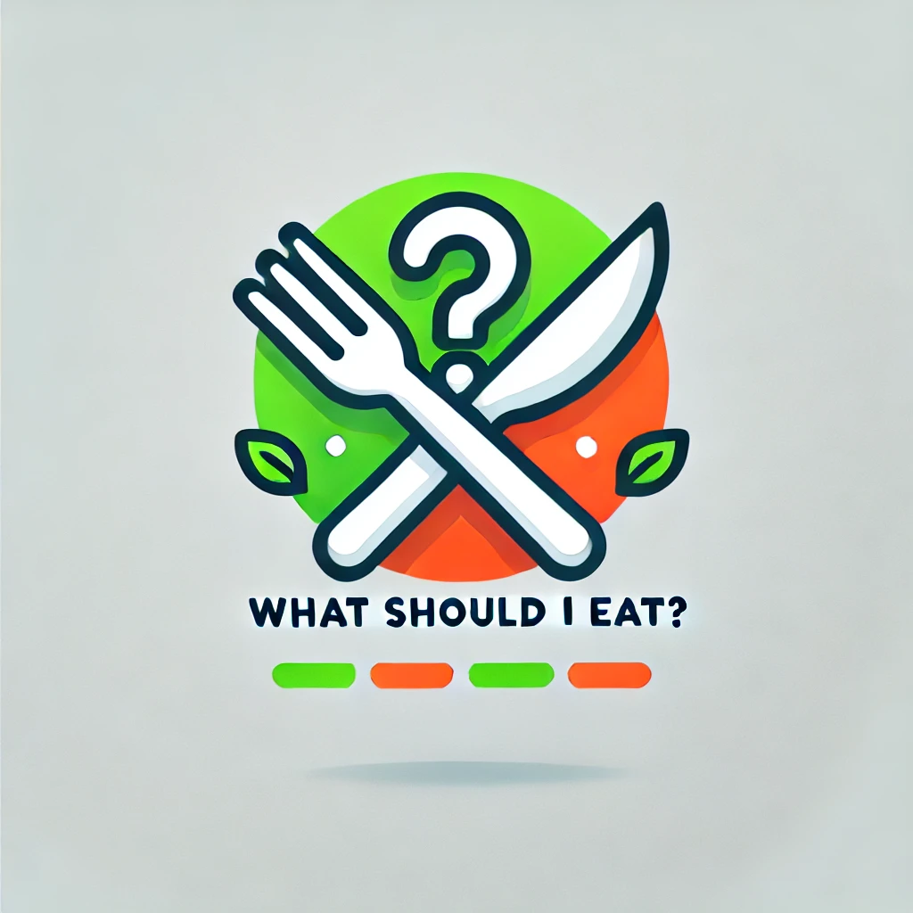

# What Should I Eat?



## Overview

**What Should I Eat?** is a web application that helps users find recipes based on their search queries. The app fetches recipes from the Edamam API and displays them dynamically on the page.

## Features

- **Dynamic Recipe Search**: Type in the search bar to find recipes.
- **API Integration**: Uses Edamam API to fetch recipes.
- **Responsive Design**: Works on all devices.

## Technologies Used

- **HTML5**: For structuring the content.
- **CSS3**: For styling the application.
- **JavaScript**: For dynamic functionality and API interactions.
- **Edamam API**: For fetching recipe data.

## Installation

1. Clone the repository:
    ```bash
    git clone https://github.com/baturayaginli/What-Should-I-Eat.git
    ```
2. Navigate to the project directory:
    ```bash
    cd What-Should-I-Eat
    ```
3. Open `index.html` in your preferred web browser.

## Usage

1. Type a keyword into the search bar.
2. Wait for the recipes to load.
3. Click on a recipe to see more details or search it on Google.

## Code Explanation

### HTML (`index.html`)
- Sets up the structure of the web page.
- Includes a search input and a container for displaying recipes.

### CSS (`styles.css`)
- Styles the layout and design of the web page.
- Provides responsive design adjustments.

### JavaScript (`script.js`)
- Adds event listeners for user interactions.
- Fetches and displays recipes from the Edamam API.
- Provides a function to search recipes on Google.

### Example Code Snippet

```javascript
document.addEventListener('DOMContentLoaded', () => {
    const searchInput = document.getElementById('searchInput');
    const recipeContainer = document.getElementById('recipeContainer');

    searchInput.addEventListener('keyup', () => {
        const query = searchInput.value;
        if (query.length > 2) {
            fetchRecipes(query);
        }
    });

    async function fetchRecipes(query) {
        const appId = 'YOUR_APP_ID';
        const appKey = 'YOUR_APP_KEY';
        const response = await fetch(`https://api.edamam.com/search?q=${query}&app_id=${appId}&app_key=${appKey}`);
        const data = await response.json();
        displayRecipes(data.hits);
    }

    function displayRecipes(recipes) {
        recipeContainer.innerHTML = '';
        recipes.forEach(recipeData => {
            const recipe = recipeData.recipe;
            const recipeCard = document.createElement('div');
            recipeCard.classList.add('recipe-card');

            recipeCard.innerHTML = `
                
                <div class="details">
                    <h2>${recipe.label}</h2>
                    <p>${recipe.source}</p>
                    <button onclick="searchOnGoogle('${recipe.label}')">Search this on Google</button>
                </div>
            `;
            recipeContainer.appendChild(recipeCard);
        });
    }

    window.searchOnGoogle = function(query) {
        window.open(`https://www.google.com/search?q=${encodeURIComponent(query)} recipe`, '_blank');
    };
});
````
## Contributing

Contributions are welcome! Please fork this repository and open a pull request to add new features or fix bugs.

## License

This project is licensed under the [MIT License](LICENSE).


